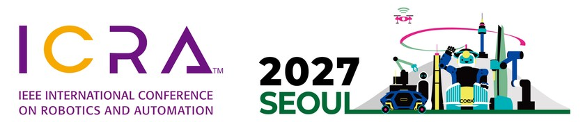

We explore the integration of design, perception, and control in aerial robots, investigating their impact on the operation and sustainable solutions for the future. Our research focuses on aerial physical interaction for applications including environmental sensing and aerial manufacturing, to advance the eco-friendly and efficient use of aerial robots. Inspired by nature, We study flexible and efficient learning schemes to develop designs, algorithms and approaches that can adapt to diverse aerial robots and tasks. Our emphasis on continuous learning enables us to tackle the complex and dynamic challenges in aerial systems and the environment.

Contact: Dr. Bahadir Kocer  
Email: b.kocer (at) bristol.ac.uk  

School of Civil, Aerospace and Design Engineering  
University of Bristol  
United Kingdom

<h2 style="clear: both; margin-top: 40px;">News</h2>

<!-- To add a news item, copy one <li> ... </li> block and put the newest one first.
     News pictures go in assets/img/news/. The classes reuse the publication list style. -->

<ol class="bibliography">

<li>

  

    <abbr class="badge rounded w-100">October 2026</abbr>
    
  

  

    
Autumn 2026 update

    
This autumn, Dr. Bahadir Kocer is serving as an Associate Editor for <a href="https://2027.ieee-icra.org/">ICRA 2027</a>, the IEEE International Conference on Robotics and Automation, which will be held in Seoul in May 2027. We wish all authors the very best of luck and hope they receive helpful, constructive feedback.

    
We are also delighted to welcome <a href="/team/">Jack Forrest</a>, who recently joined the group as a PhD student working on learning-based sensing and control for aerial robots.

  

</li>

</ol>

