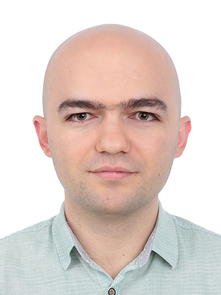
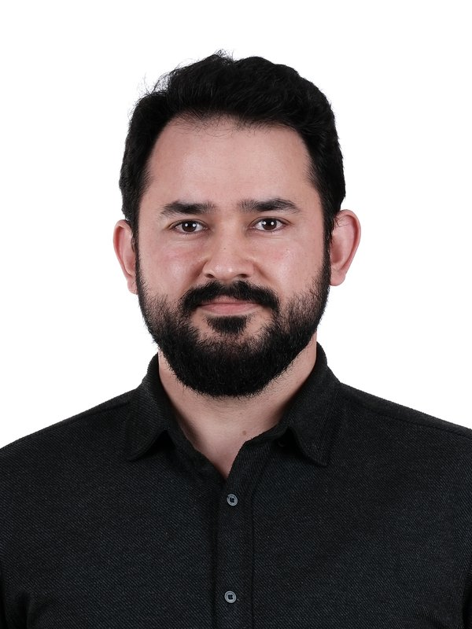
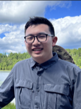
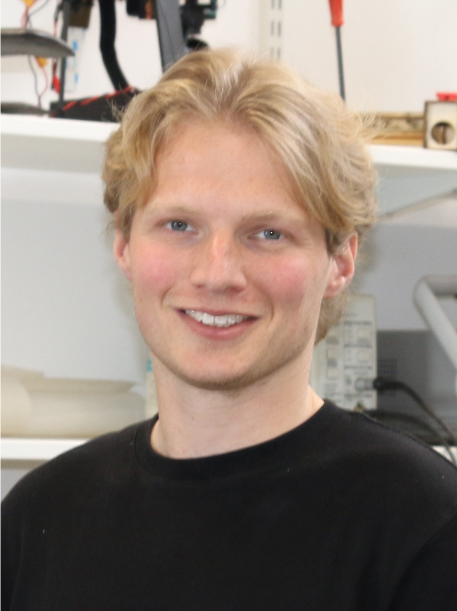
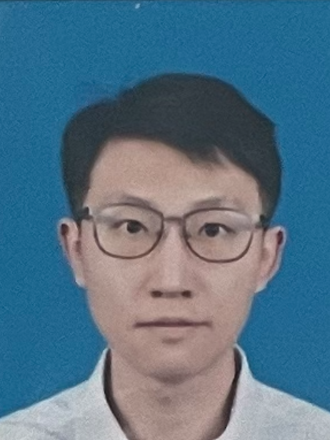
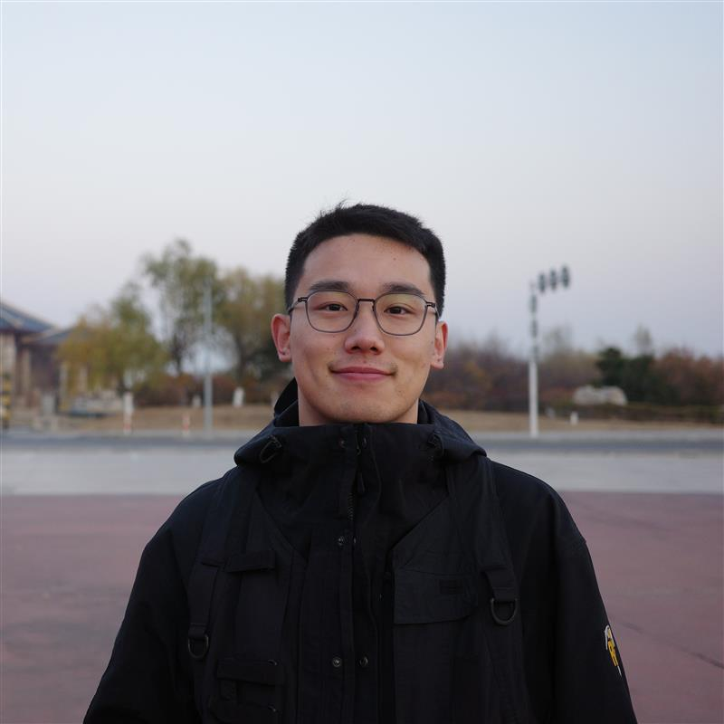
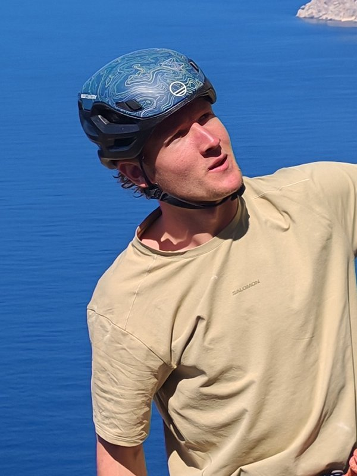
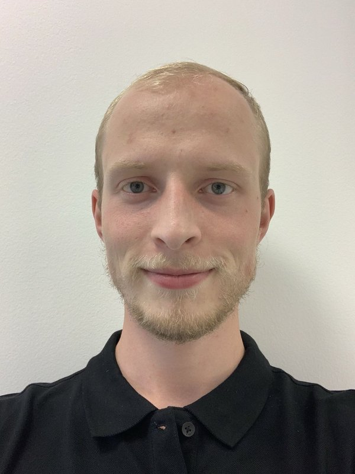
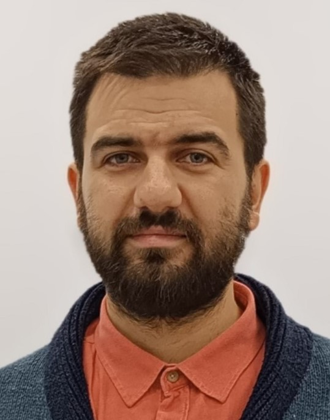

   
  <strong>Dr. Bahadir Kocer</strong> 
  <em>Lecturer</em> 
  Aerial Robotics 
  
  
  

   
  <strong>Dr. Ahmet Fevzi Bozkurt</strong> 
  <em>Visiting Research Fellow</em> 
  Soft Robotics for UAVs 
  
  
  

<!-- Researchers -->

   
  <strong>Haichuan Li</strong> 
  <em>PhD Student</em> 
  Perching Mechanism 
  
  
  

   
  <strong>Ziang Zhao</strong> 
  <em>PhD Student</em> 
  Minimal Invasive Design 
  
  
  

   
  <strong>Ziniu Wu</strong> 
  <em>PhD Student</em> 
  Robot Learning 
  
  
  

   
  <strong>Alex Dunnett</strong> 
  <em>PhD Student</em> 
  Perception and Guidance 
  
  
  

   
  <strong>Jianduo Chai</strong> 
  <em>PhD Student</em> 
  Trajectory Prediction 
  
  
  

   
  <strong>Luke Wainwright</strong> 
  <em>PhD Student</em> 
  Aerial Robotics 
  
  
  

   
  <strong>Ke Tian</strong> 
  <em>PhD Student</em> 
  Path Planning 
  
  
  

   
  <strong>Jelly Liu</strong> 
  <em>PhD Student</em> 
  Soft Aerial Robotics 
  
  
  

   
  <strong>Jack Forrest</strong> 
  <em>PhD Student</em> 
  Learning-based Sensing and Control 
  
  

   
  <strong>Šimon Prokop</strong> 
  <em>Research Intern</em> 
  Visual Robot Navigation 
  
  
  

<h2 style="margin: 40px 0 20px;">Alumni</h2>

   
  <strong>Dr. Ali Karasahin</strong> 
  <em>Visiting Research Fellow</em> 
  Learning-based Control 
  Next position: 
  Assistant Professor at Necmettin Erbakan University 
  
  
  

